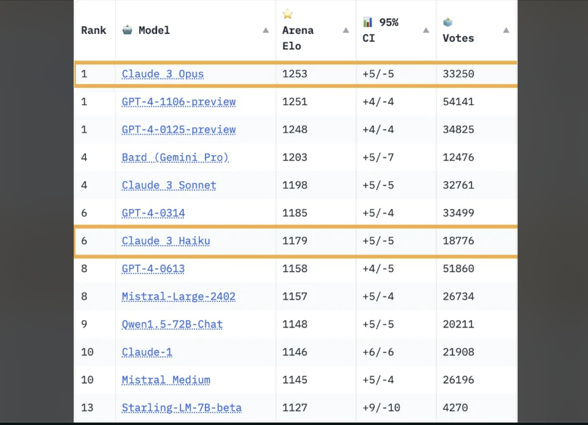

# How Do I?

Simple CLI tool that targets LLM APIs to figure how to do stuff quickly!

Gemini Flash is the model used by default. You can change the model with the -m flag: `... -m "opus"`.

Supports Anthropic, Gemini, and GPT models.



## Install

Download:

You can download the latest release from the releases tab.

Export the key for the model(s) you want to use:

```sh
`ANTHROPIC_API_KEY`.
`GEMINI_API_KEY`.
`OPENAI_API_KEY`.
```

## Usage

The program takes in an array of arguments. These can be images, text files, or a plain string. If you have context you'll pass those in first and then type your question at the end.

```sh
howdoi context1.js context2.html "this is my question"
howdoi animal.png "what is the animal in the image"
```

### Flags

```sh
CLI tool to interact with LLM APIs. Messages can be written text or image files.

Usage:
  howdoi [messages...] [flags]

Flags:
  -h, --help                  help for howdoi
  -t, --max-tokens int        Maximum number of tokens to generate (default 2048)
  -m, --model string          Model to use) (default "flash")
  -e, --temperature float32   Temperature
```

## Examples

### λ ~/code/howdoi: howdoi "how do i write a web server with bun"

To write a web server with Bun, you can follow these steps:

1. **Install Bun**: First, you need to install Bun on your system. You can download it from the official Bun website (https://bun.sh/) and follow the installation instructions for your operating system.

2. **Create a new Bun project**: Open your terminal or command prompt and navigate to the directory where you want to create your project. Then, run the following command to create a new Bun project:

   ```
   bun create my-web-server
   ```

   This will create a new directory called `my-web-server` with the necessary files and folders for a Bun project.

3. **Create a server file**: Inside the `my-web-server` directory, create a new file called `server.js`. This will be the main file for your web server.

4. **Write the server code**: In the `server.js` file, you can start by importing the necessary Bun modules and creating a new server instance. Here's an example:

   ```javascript
   import { serve } from "bun";

   serve((request) => {
     return new Response("Hello, World!");
   });
   ```

   This code creates a simple web server that responds with "Hello, World!" for every incoming request.

   You can customize the server code to handle different routes, serve static files, or perform more complex operations. Bun provides a wide range of built-in features and APIs to help you build your web server.

5. **Run the server**: To start the server, run the following command in your terminal:

   ```
   bun run server.js
   ```

   This will start the Bun server and make it available at `http://localhost:3000` (or a different port if you've configured it).

6. **Test the server**: Open a web browser and navigate to `http://localhost:3000`. You should see the "Hello, World!" message displayed.

That's the basic setup for a web server using Bun. As you progress, you can explore more advanced features and functionality provided by Bun, such as routing, middleware, database integration, and more. The Bun documentation (https://bun.sh/docs) is a great resource to learn more about building web applications with Bun.

2024/04/02 13:27:52 Usage: Input Tokens: 17, Output Tokens: 529, Total Cost: $0.000666

***

Oh no! This doesn't actually work there's no template called my-web-server. Let's add some context:


### λ ~/code/howdoi: howdoi https://bun.sh/guides/ecosystem/hono "how do i write a web server with bun"

2024/04/02 15:20:21 Scraping the web page: https://bun.sh/guides/ecosystem/hono
Based on the information provided in the document, here's how you can write a web server using Bun and the Hono framework:

1. **Install Bun and Hono**:
   - Use the `bun create hono myapp` command to create a new Hono project with the Bun template.
   - Navigate to the project directory: `cd myapp`.
   - Install the dependencies: `bun install`.

2. **Create the server**:
   - In the `src/index.ts` file, import the `Hono` class from the `hono` package:
     ```typescript
     import { Hono } from "hono";
     ```
   - Create a new `Hono` instance and define your routes:
     ```typescript
     const app = new Hono();

     app.get("/", (c) => c.text("Hono!"));
     ```
   - Export the `app` instance as the default export:
     ```typescript
     export default app;
     ```

3. **Start the development server**:
   - Run the development server using the `bun run dev` command.
   - This will start the server and make it available at `http://localhost:3000`.

4. **Customize the server**:
   - You can add more routes, middleware, and functionality to the `app` instance as needed.
   - Refer to the Hono documentation for more information on how to use the framework and its features.

Here's the complete code for the `src/index.ts` file:

```typescript
import { Hono } from "hono";

const app = new Hono();

app.get("/", (c) => c.text("Hono!"));

export default app;
```

By following these steps, you can create a basic web server using Bun and the Hono framework. You can then further customize and expand the server to meet your application's requirements.

2024/04/02 15:20:25 Usage: Input Tokens: 955, Output Tokens: 453, Total Cost: $0.000805

***

Ok, now this actually works!

## Extra

Content is written to stdout so you can pipe the content to a file.

```sh
λ ~/code/howdoi: howdoi "add a line break to a markdown file. the line break should be visible, like a clear separation of two sections" > foo.txt
2024/04/02 15:34:47 Usage: Input Tokens: 30, Output Tokens: 75, Total Cost: $0.000101
λ ~/code/howdoi: cat foo.txt
───────┬─────────────────────────────────────────────────────────────────────────────────
       │ File: foo.txt
───────┼─────────────────────────────────────────────────────────────────────────────────
   1   │ To add a visible line break in a Markdown file, you can use the HTML `<br>` tag
       │ or three consecutive asterisks `***`.
   2   │
   3   │ Here's an example:
   4   │
   5   │ Section 1
   6   │
   7   │ ***
   8   │
   9   │ Section 2
  10   │
  11   │ This will create a clear separation between the two sections, with the line brea
       │ k being visible in the rendered Markdown.
  12   │
```
